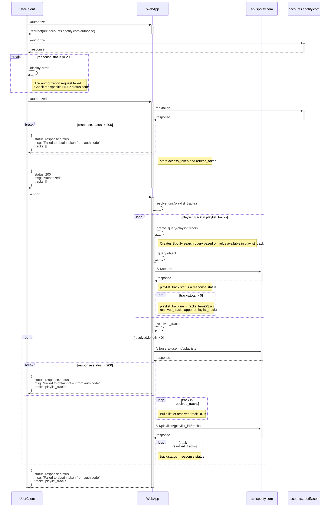
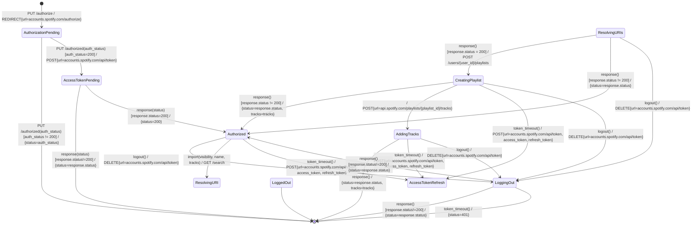
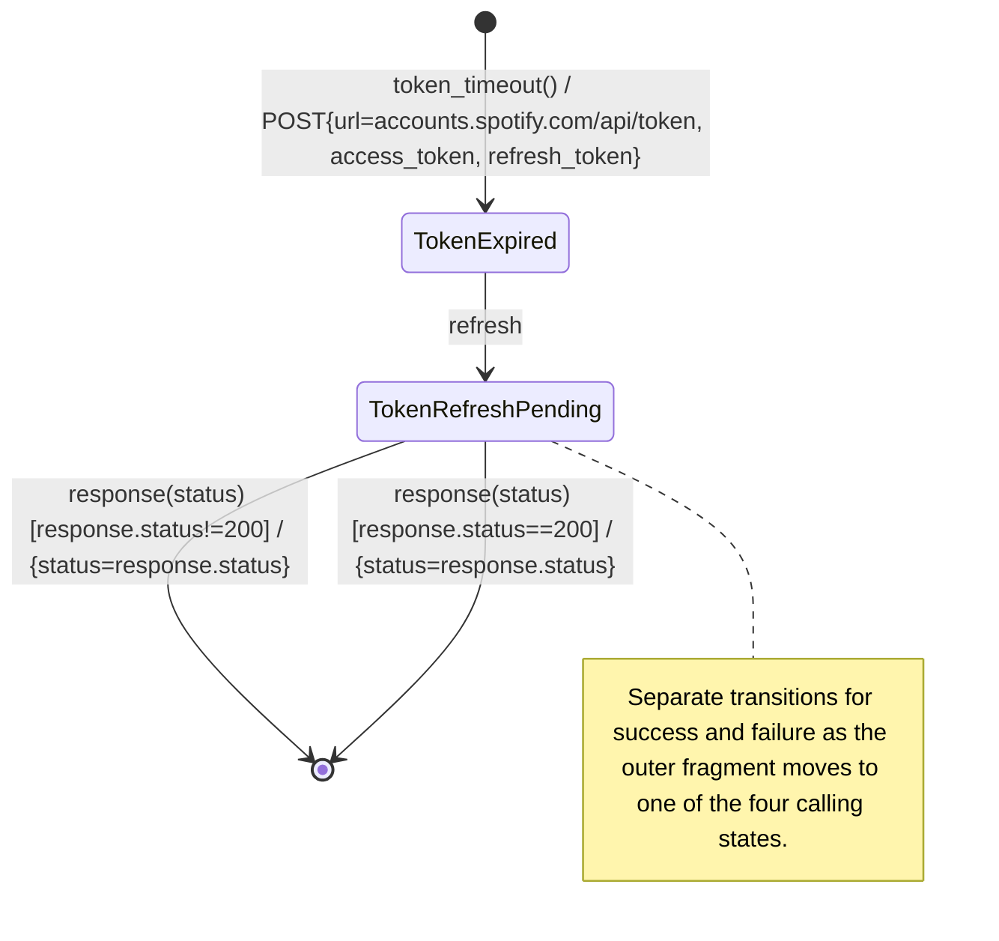

# Detailed Design

# Description

- The system shall accept login credentials and submits them to the Spotify API.
- The system shall handle the response from the Spotify API.
- The system shall handle both successful and unsuccessful login attempts.
- The system shall allow the user to logout.
- The system shall allow the user to import playlists from a file.
- The system shall allow the user to import playlists from Apple Music.
- The system shall accept a playlist in M3U format.
- The system shall accept a playlist in XCF format.
- The system shall accept the playlist to create upon successful login.

# State Machine

## System Sequence Diagram

## Service State Diagram

### Start

| Trigger | Guard | Behavior | Destination State |
| --- | --- | --- | --- |
| `PUT /authorize` | - | Send to client a redirect to Spotify authorization page. | `AuthorizationPending` |

### AuthorizationPending

| Trigger | Guard | Behavior | Destination State |
| --- | --- | --- | --- |
| `PUT /authorized` | auth_status != 200 | Send to client an error message. | Terminal |
| `PUT /authorized` | auth_status == 200 | Request access token from Spotify API. | `AccessTokenPending` |

### AccessTokenPending

### Authorized

### ResolvingURIs

### CreatingPlaylist

### AddingTracks

### LoggingOut

## Token Expiration and Refresh

- The system shall handle token timeout from each of the following states.
    - Authorized
    - ResolvingURIs
    - CreatingPlaylist
    - AddingTracks
    - LoggingOut
        - If the token expires while logging out, the system will transition directly to `LoggedOut` regardless of the outcome of the `logout` operation.

- The system shall handle token timeout with a transition from the originating state to a `TokenExpired` state.
- The system shall transition back to the originating state after a successful token refresh.
- The system shall transition to `LoggedOut` after a failed token refresh.

